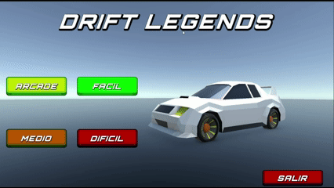
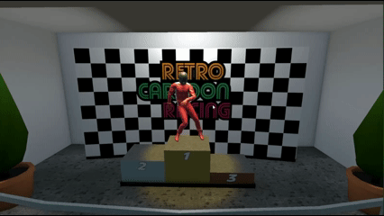
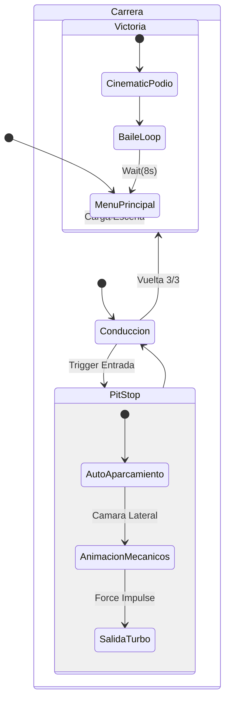

# 🏎️ Unity Racing: JDM Drift & Cinematic Experience


Simulador de carreras estilo Low-Poly / Arcade desarrollado en Unity. Este proyecto combina físicas de vehículos basadas en WheelColliders con una fuerte dirección artística inspirada en la cultura JDM, integrando cinemáticas en tiempo real, gestión de eventos (Boxes/Victoria) y una interfaz de usuario reactiva.

🔗 **Repo URL:** https://github.com/dsanchezp25/unity-racing-physics


*Demostración del sistema de físicas, partículas y marcas de neumático.*

## 📸 Galería

| Menú de Selección |
| :---: |
|  |

### Variantes del Circuito (Ciclo Día/Noche)
El juego adapta la iluminación global según el circuito seleccionado:

| Circuito 1 (Día) | Circuito 2 (Atardecer) | Circuito 3 (Noche) |
| :---: | :---: | :---: |
|  |  |  |

### Nuevas vistas

| PODIO | BOXES |
| :---: | :---: |
|  |  |

## ✨ Características Principales

### 1. Físicas y Control (`ControladorRealista.cs`)
El núcleo de la conducción busca el equilibrio entre simulación y diversión arcade:
- **WheelCollider Nativo:** Simulación de suspensión, fricción y transferencia de pesos.
- **Drift Asistido:** Modificación dinámica de la curva de fricción (`stiffness`) al usar el freno de mano.
- **Curva de Potencia:** Entrega de par motor no lineal mediante `AnimationCurve`.
- **Ayudas a la Conducción:** Contravolante suavizado y reducción de ángulo de giro a altas velocidades.

### 2. Experiencia Cinematográfica (NUEVO)
El juego deja de ser una cámara estática para convertirse en una experiencia dirigida:
- **Sistema de Boxes (Pit Stop):**
  - **Entrada Automática:** Al entrar al trigger, la IA toma el control y aparca el coche suavemente.
  - **Cámaras TV:** Corte a cámara lateral a ras de suelo para enfatizar la acción.
  - **Pit Crew Animado:** Mecánicos (Mixamo) sincronizados que aparecen instantáneamente. Incluye lógica de *Easter Egg* ("Mecánico Torpe") con timing ajustado.
  - **Launch Control:** Salida impulsada con física tras la reparación.
- **Secuencia de Victoria:**
  - Al completar las vueltas, el juego transiciona al **Podio**.
  - Teletransporte del coche, activación de focos, confeti y personaje animado celebrando (bucle infinito).
  - Retorno automático al menú principal tras la celebración.

### 3. Interfaz de Usuario "JDM Style"
Rediseño total de la UI para transmitir velocidad y agresividad:
- **Menú Principal:** Diseño inclinado (Slanted UI), paleta de colores de alto contraste y animaciones *hover* reactivas.
- **HUD In-Game:**
  - **Velocímetro Digital:** Texto de gran formato inclinado.
  - **Barra de RPM:** Feedback visual de la potencia del motor.
  - **Panel de Tiempos:** Caja estilizada con tiempos de vuelta y mejor vuelta.


## 🛠️ Arquitectura Técnica

### Gestión de Carrera (`GestorDeCarrera.cs` + `GestorFinal.cs`)
El juego utiliza un patrón de "Directores" para manejar el estado del juego:
1. **GestorDeCarrera:** Controla vueltas, tiempos y lógica de circuito (barreras/ciclo día-noche).
2. **PitStopManager:** Orquesta la corrutina de parada (Control IA -> Animaciones -> Cámaras -> Físicas).
   - *Feature destacada:* Sistema de **"Posición Reset"** para los mecánicos, evitando el desplazamiento por *Root Motion* en paradas sucesivas.
3. **GestorFinal:** Se activa al cruzar la meta en la última vuelta, apagando la lógica de carrera y lanzando la cinemática de victoria.

### Diagrama de Flujo de Estados



## 🕹️ Controles (Acción / Tecla)

| Acción | Tecla / Input | Descripción |
| :--- | :--- | :--- |
| **Acelerar** | `W` / `Flecha Arriba` | Aceleración progresiva (Curva de Potencia) |
| **Frenar / Reverso** | `S` / `Flecha Abajo` | Freno inteligente / Marcha atrás |
| **Girar** | `A` / `D` / `Flechas` | Dirección suavizada |
| **Freno de Mano** | `Barra Espaciadora` | Bloquea ruedas traseras (Drift) |
| **Reiniciar Coche** | `R` | Respawn (endereza el coche) |

---

## 🛠️ Instalación y Uso

### 1. Clonar el repositorio
```bash
git clone https://github.com/dsanchezp25/unity-racing-physics.git
```

> Nota: Si descargas el ZIP sin la carpeta *Library*, la primera carga tardará unos minutos en regenerar la caché.

### 2. Abrir en Unity
- Unity Hub > Add > Seleccionar carpeta.
- Versión recomendada: Unity 6 (o 2022.3 LTS con TextMeshPro instalado).

### 3. Jugar
1. Ve a `Assets/Scenes`.
2. Abre la escena **MenuPrincipal**.
3. Dale al **Play**.

---

*Desarrollado por [dsanchezp25](https://github.com/dsanchezp25) y [Ccrespo7](https://github.com/Ccrespo7)*
