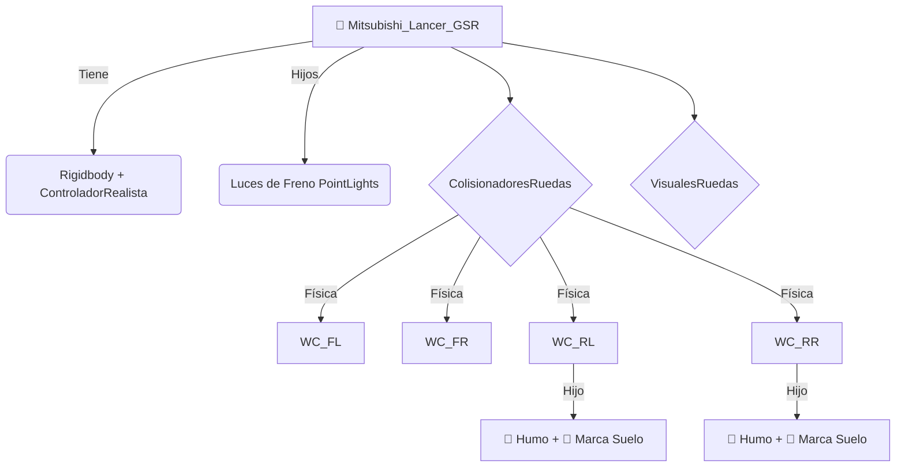

# 🏎️ Unity Racing Physics & Drift Simulator


Repositorio de simulación de vehículos en Unity que implementa, evoluciona y compara dos arquitecturas de físicas distintas: **Arcade (Raycast)** vs **Simulación (WheelCollider)**. Este proyecto sirve como base para juegos de carreras con mecánicas de drift avanzadas, efectos visuales dinámicos y lógica de circuito inteligente.

🔗 **Repo URL:** https://github.com/dsanchezp25/unity-racing-physics


*Demostración del sistema de físicas, partículas y marcas de neumático.*

## 📸 Galería

| Menú de Selección |
| :---: |
|  |

### Variantes del Circuito (Ciclo Día/Noche)
El juego adapta la iluminación global según el circuito seleccionado:

| Circuito 1 (Día) | Circuito 2 (Atardecer) | Circuito 3 (Noche) |
| :---: | :---: | :---: |
|  |  |  |
*(Nota: Reemplazar estos links con capturas reales de la carpeta Assets para mostrar el Post-Processing)*

## 🌟 Arquitecturas de Física
### 1. Sistema Realista (`ControladorRealista.cs`) — (Activo actualmente)
Es el núcleo de la aplicación. Utiliza el sistema nativo de suspensión y fricción de **Unity WheelColliders** para simular la transferencia de pesos y la suspensión real.

- **Motor con Curva de Potencia:** Simulación de entrega de par motor no lineal mediante `AnimationCurve`.
- **Drift/Handbrake:** La fricción lateral de las ruedas traseras se modifica dinámicamente al pulsar la barra espaciadora (`stiffness` baja drásticamente).
- **Control Progresivo:** El ángulo de giro del volante se reduce dinámicamente a alta velocidad para evitar el sobreviraje.
- **Estabilidad:** Implementación de *Downforce* y ajuste de **Centro de Masas** para evitar vuelcos en curvas.

### 2. Estructura de Interfaz (UI/UX)
- **Menú Principal & Pausa:** Transición suave entre escenas (`Fade Out`) y menú de pausa funcional con control de `Time.timeScale` y `AudioListener.pause`.
- **Lap Timer & Best Lap:** Contador de tiempo en pantalla que registra y muestra el tiempo de vuelta más rápido.
- **Velocímetro:** UI digital (`TextMeshPro`) con barra de progreso circular dinámica (cambia de color de cian a rojo según la velocidad).

## 🎨 Gráficos y Entorno (VFX)

- **Post-Procesado Avanzado:** Perfil de *Global Volume* configurado con **Bloom** (para halos de luz), **Motion Blur** (sensación de velocidad) y **Tonemapping ACES** (para un color cinematográfico).
- **Ciclo Día/Noche Controlado:** El script `CicloDiaNoche.cs` permite forzar horas específicas (12:00, 18:00, 23:00) o aleatorias para las carreras.
- **Faros Dinámicos:** Las luces delanteras (`Spot Lights`) se activan automáticamente al anochecer.
- **Partículas:** Humo volumétrico y `TrailRenderer` para marcas de derrape, ambos activados mediante el `sidewaysSlip` de la rueda.

## 🧠 Lógica de Pista y Flujo de Juego

- **Circuito Dinámico:** El sistema `GestorDeCarrera.cs` lee la elección del menú y desactiva las barreras que no se usarán. En el modo cambiante, la ruta se elige aleatoriamente al cruzar la meta.
- **Contador de Vueltas:** Sistema de `DetectorMeta.cs` que comunica al Gestor la finalización de una vuelta, actualizando el contador y la lógica de cambio de circuito.
- **Sistema de Respawn:** Reinicia posición y rotación si el coche vuelca.

## 📐 Diagramas Técnicos

### Jerarquía del Vehículo


### Flujo de Datos (Menú a Carrera)
```mermaid
flowchart TD
    Menu[MenuPrincipal] -- Guarda Elección (INT) --> PlayerPrefs[Caja Fuerte Compartida]
    Menu -- Inicia Coroutine (Fade) --> SceneLoad(SceneManager.LoadScene)
    SceneLoad --> Game[Circuito_Realista]
    Game --> Gestor[GestorDeCarrera.Start()]
    Gestor -->|Lee Modo| PlayerPrefs
    Gestor -->|Set Hora/Muros| Lights/Barriers
    
    Trigger[Meta Cruzada] --> Gestor{NuevaVuelta()}
```

## 🕹️ Controles (Acción / Tecla)

| Acción | Tecla / Input | Descripción |
| :--- | :--- | :--- |
| **Acelerar** | `W` / `Flecha Arriba` | Aceleración progresiva (Curva de Potencia) |
| **Frenar / Reverso** | `S` / `Flecha Abajo` | Freno inteligente / Marcha atrás |
| **Girar** | `A` / `D` / `Flechas` | Dirección suavizada |
| **Freno de Mano** | `Barra Espaciadora` | Bloquea ruedas traseras (Drift) |
| **Reiniciar Coche** | `R` | Respawn (endereza el coche) |

---

## 🛠️ Instalación y Uso

### 1. Clonar el repositorio
```bash
git clone https://github.com/dsanchezp25/unity-racing-physics.git
```

> Nota: Si descargas el ZIP sin la carpeta *Library*, la primera carga tardará unos minutos en regenerar la caché.

### 2. Abrir en Unity
- Unity Hub > Add > Seleccionar carpeta.
- Versión recomendada: Unity 6 (o 2022.3 LTS con TextMeshPro instalado).

### 3. Jugar
1. Ve a `Assets/Scenes`.
2. Abre la escena **MenuPrincipal**.
3. Dale al **Play**.

---

## 🤝 Contribuciones y Futuro

Ideas para futuras expansiones del proyecto (Roadmap):

- [ ] **Sonido Avanzado:** Cambio de tono del motor según RPM.
- [ ] **Nitro / Turbo:** Impulso con distorsión de cámara (FOV).
- [ ] **Base de Datos:** Guardado de "Best Lap" en SQL/Local.
- [ ] **Daños:** Deformación de malla al chocar.

---

*Desarrollado por [dsanchezp25](https://github.com/dsanchezp25) y [Ccrespo7](https://github.com/Ccrespo7)*
