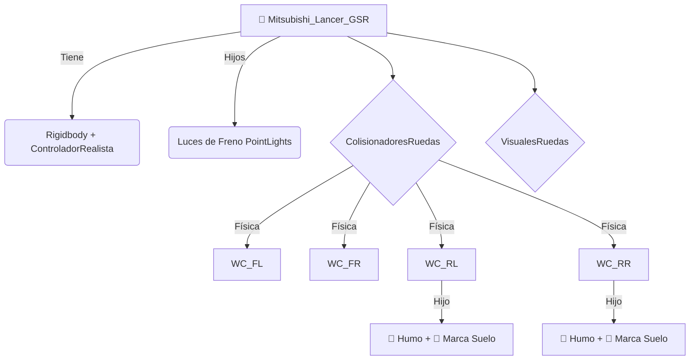

# 🏎️ Unity Racing Physics & Drift Simulator


Repositorio de simulación de vehículos en Unity que implementa, evoluciona y compara dos arquitecturas de físicas distintas: **Arcade (Raycast)** vs **Simulación (WheelCollider)**. Este proyecto sirve como base para juegos de carreras con mecánicas de drift avanzadas, efectos visuales dinámicos y lógica de circuito inteligente.

🔗 **Repo URL:** https://github.com/dsanchezp25/unity-racing-physics


*Demostración del sistema de físicas, partículas y marcas de neumático.*

## 📸 Galería

| Menú de Selección |
| :---: |
|  |

### Variantes del Circuito (Ciclo Día/Noche)
El juego adapta la iluminación global según el circuito seleccionado:

| Circuito 1 (Día) | Circuito 2 (Atardecer) | Circuito 3 (Noche) |
| :---: | :---: | :---: |
|  |  |  |
*(Nota: Reemplazar estos links con capturas reales de la carpeta Assets para mostrar el Post-Processing)*

## 🌟 Arquitecturas de Física

El proyecto contiene dos sistemas de control independientes para explorar diferentes sensaciones de conducción:

### 1. Sistema Arcade (`ControladorLancer.cs`)
Diseñado para una jugabilidad directa y permisiva, estilo *Mario Kart* o *Need for Speed* antiguo.

- **Física Custom (Raycast):** Evita el uso de ruedas físicas complejas. Utiliza rayos para detectar el suelo y aplica fuerzas vectoriales directas.
- **Drift Asistido:** Interpolación lineal (`Mathf.Lerp`) entre fricción normal y deslizamiento al usar el freno de mano.
- **Anti-Vuelo:** Sistema de *Downforce* basado en detección de suelo para evitar que el coche "despegue" en rampas o baches.

### 2. Sistema Realista (`ControladorRealista.cs`) — (Activo actualmente)
Diseñado para simulación técnica, transferencia de pesos y físicas emergentes.

- **Unity WheelColliders:** Utiliza el sistema nativo de suspensión y fricción de Unity.
- **Motor con Curva de Potencia:** Simulación de entrega de par motor no lineal mediante `AnimationCurve`.
- **Dirección Progresiva:** El ángulo de giro del volante se reduce dinámicamente según la velocidad.
- **Ayudas a la Conducción:** Suavizado de input y estabilizadores angulares para control con teclado.

## 🎨 Gráficos y Entorno (VFX)

- **Ciclo Día/Noche:** `CicloDiaNoche.cs` que rota la iluminación global en tiempo real.
- **Post-Procesado:** Perfil de *Global Volume* con **Bloom**, **Motion Blur** y **Tonemapping ACES**.
- **Feedback Visual:**
  - **Luces de Freno:** `Point Lights` rojas que reaccionan a la frenada y al freno de mano.
  - **Partículas:** Humo volumétrico en las ruedas traseras al perder tracción.
  - **Skidmarks:** `TrailRenderer` que pinta marcas en el asfalto.
- **UI:** Velocímetro digital en tiempo real (km/h) usando TextMeshPro.

## 🧠 Lógica de Juego

- **Circuito Dinámico:** `SelectorDeCamino.cs` para bloquear rutas alternativas al inicio de la carrera.
- **Sistema de Respawn:** Reinicia posición y rotación si el coche vuelca.

## 📐 Diagramas Técnicos

### Jerarquía del Vehículo



## 🕹️ Controles (Acción / Tecla)

| Acción | Tecla / Input | Descripción |
| :--- | :--- | :--- |
| **Acelerar** | `W` / `Flecha Arriba` | Aceleración progresiva (Curva de Potencia) |
| **Frenar / Reverso** | `S` / `Flecha Abajo` | Freno inteligente / Marcha atrás |
| **Girar** | `A` / `D` / `Flechas` | Dirección suavizada |
| **Freno de Mano** | `Barra Espaciadora` | Bloquea ruedas traseras (Drift) |
| **Reiniciar Coche** | `R` | Respawn (endereza el coche) |

---

## 🛠️ Instalación y Uso

### 1. Clonar el repositorio
```bash
git clone https://github.com/dsanchezp25/unity-racing-physics.git
```

> Nota: Si descargas el ZIP sin la carpeta *Library*, la primera carga tardará unos minutos en regenerar la caché.

### 2. Abrir en Unity
- Unity Hub > Add > Seleccionar carpeta.
- Versión recomendada: Unity 6 (o 2022.3 LTS con TextMeshPro instalado).

### 3. Jugar
1. Ve a `Assets/Scenes`.
2. Abre la escena **Circuito_Version_Realista**.
3. Dale al **Play**.

---

## 📂 Estructura de Carpetas y Scripts

### `Assets/Scripts/`
- `ControladorRealista.cs` — Lógica principal del vehículo (Motor, Suspensión, Luces).
- `EfectosRueda.cs` — Control de partículas y huellas.
- `SistemaRespawn.cs` — Reinicio de posición.
- `CicloDiaNoche.cs` — Rotación del sol.
- `SelectorDeCamino.cs` — Lógica del circuito dinámico.

### `Assets/Prefabs/`
- Vehículos configurados (ej. `Lancer_Realista`).

### `Assets/Materials/`
- Materiales físicos y visuales (Partículas, Trail).

---

## 🤝 Contribuciones y Futuro

Ideas para futuras expansiones del proyecto (Roadmap):

- [ ] **Sonido Avanzado:** Cambio de tono del motor según RPM.
- [ ] **Nitro / Turbo:** Impulso con distorsión de cámara (FOV).
- [ ] **Base de Datos:** Guardado de "Best Lap" en SQL/Local.
- [ ] **Daños:** Deformación de malla al chocar.

---

*Desarrollado por [dsanchezp25](https://github.com/dsanchezp25) y [Ccrespo7](https://github.com/Ccrespo7)*
